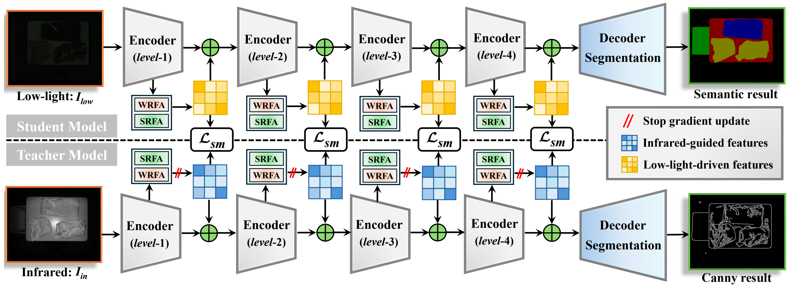
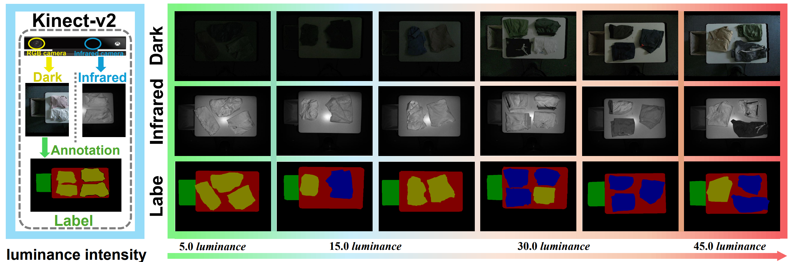

## 💥 Motivation
In this work, we discovered that simply converting existing semi-segmentation methods into a pure-transformer framework is ineffective. 
<p align="center">

</p>

# requirements

```
einops	0.6.1	
numpy	1.23.0
pip	23.2.1
scikit-image	0.21.0	
scikit-learn	1.3.2	
scikit-posthocs	0.8.0
scipy	    1.10.1
tensorboard	    2.14.0
tensorboard-data-server   0.7.1	
torch	          1.13.1+cu116	
torchsummary  1.5.1	
torchvision	   0.14.1+cu116
tqdm	      4.66.1
```
# datasets
The preview of our Darkclothes dataset is as follows.
<p align="center">

</p>

Our Darkclothes is available at [Google Drive](https://drive.google.com/file/d/1Ee8ReaP48tECyilH6Yc08N6aU_qibGch/view?usp=sharing) 
```bash
data
   ├─dark（dark images)
   ├─images (igfrared images)
   └─masks (labels)
   
```
# train
```
train_D.py : use dark and infrareds images to  train the network.
train_dark.py : only use dark images to  train the network.
train_infrared.py : only use infrared images to  train the network.
predict_Multi.py : use for multi-classes predict
predict_Single.py : use for single-classes predict
```
